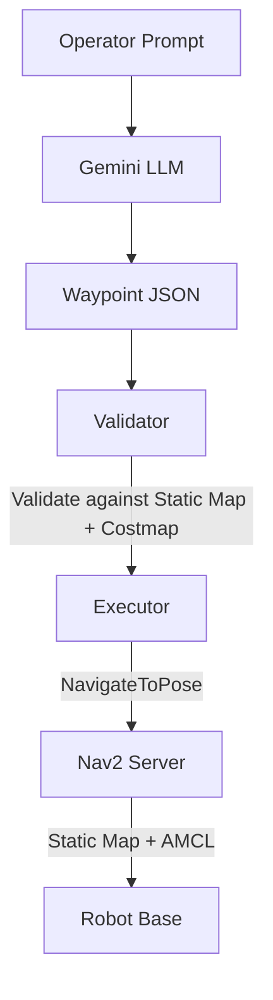
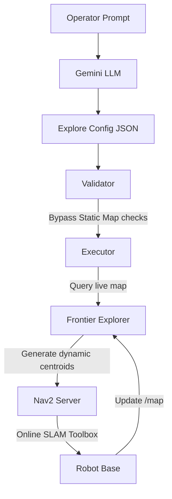
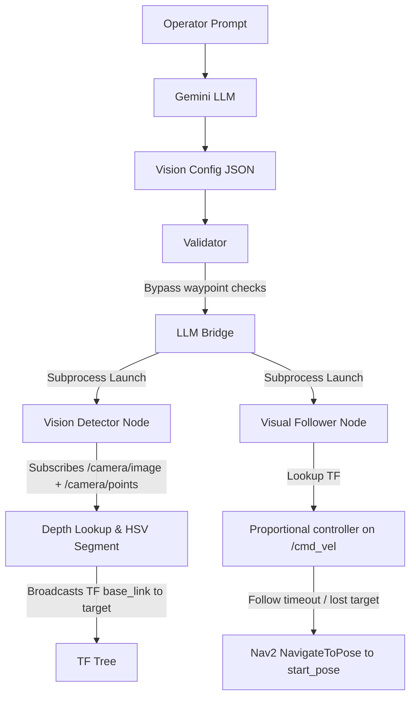

# ROS 2 LLM Mission Control

**Natural-language mission planning for an autonomous ground robot - Prompt → LLM → Validated JSON → Deterministic Executor → Gazebo / Nav2.**

---

## Table of Contents

- [Architecture Overview](#architecture-overview)
- [Pipeline Walkthrough](#pipeline-walkthrough)
- [Repository Structure](#repository-structure)
- [Quick Start (Docker Container)](#quick-start-docker-container)
- [Quick Start (Local Native Installation)](#quick-start-local-native-installation)
- [Example Prompts](#example-prompts)
- [Mission JSON Schema](#mission-json-schema)
- [Validation & Safety Guardrails](#validation--safety-guardrails)
- [Challenges Attempted](#challenges-attempted)
- [Scaling to Real-World Systems](#scaling-to-real-world-systems)
- [Cited Sources](#cited-sources)
- [Tech Stack](#tech-stack)
- [License](#license)

---

## Architecture Overview

The system implements a strict four-layer pipeline where the LLM **proposes** but never **flies**. The same validated JSON always produces the same robot behavior - the LLM is never in the control loop.

```
┌─────────────────────────────────────────────────────────────────────────────────┐
│                        LLM Mission Control Pipeline                             │
│                                                                                 │
│   ┌──────────┐    ┌──────────────┐    ┌─────────────────┐    ┌───────────────┐  │
│   │  PROMPT  │───▶│   GEMINI     │───▶│   VALIDATOR     │───▶│   EXECUTOR    │  │
│   │          │    │   (LLM)      │    │                 │    │               │  │
│   │ Natural  │    │ Structured   │    │ JSON Schema     │    │ Nav2 Action   │  │
│   │ language │    │ JSON output  │    │ Map bounds      │    │ Client        │  │
│   │ command  │    │ via Pydantic │    │ Costmap check   │    │ Waypoint nav  │  │
│   └──────────┘    └──────────────┘    └─────────────────┘    └───────┬───────┘  │
│                                                                      │          │
│                                                              ┌───────▼───────┐  │
│                                                              │  SIMULATOR    │  │
│                                                              │               │  │
│                                                              │ Gazebo +      │  │
│                                                              │ Nav2 + AMCL   │  │
│                                                              └───────────────┘  │
└─────────────────────────────────────────────────────────────────────────────────┘
```

### Architectural Layouts by Mode

#### Option A: Mapped Mode (Static pre-built map + AMCL)


#### Option B: Explore Mode (Online SLAM + Frontier Exploration)


#### Option C: Vision Mode (RGB-D Target Detection + Follow)


---

## Pipeline Walkthrough

Here's what happens step-by-step when you type a command:

```
1.  rclpy.init()                          ← ROS 2 node starts
2.  Create node, costmap subscriber,      ← Plumbing setup
    Nav2 action client
3.  publish_initial_pose()                ← Seeds AMCL so map→odom TF is valid (Mapped & Vision)
4.  input("Enter command: ")              ← Operator types natural language
5.  call_gemini(prompt)                   ← LLM generates structured JSON
6.  validate_json_schema(raw_json)        ← Schema + defaults + return_to_start
7.  save_mission(mission)                 ← Save timestamped JSON to missions/
8.  nav_client.wait_for_server()          ← Wait for Nav2 to be ready
9.  costmap_validator.wait_for_costmap()  ← Wait for live costmap data
10. validate_waypoints()                  ← Map bounds + costmap occupancy check
11. execute_mission()                     ← Deterministic waypoint-by-waypoint nav / subprocess nodes
```

---
## Demo Videos

https://github.com/user-attachments/assets/22c4b648-2b47-45b0-90de-ede52bd1418b

The above video shows the working of the core pipeline.

https://github.com/user-attachments/assets/7abdab16-a2e4-4227-afe3-6ce421b22600

Building on top of the core pipeline, the above video demonstrates online SLAM via the explore JSON config generated by the LLM

https://github.com/user-attachments/assets/ca638652-ebbf-45d4-9aaf-f61b1203c36f

This demo shows the detection, tracking, and following of a user specified object in the warehouse.

---


## Repository Structure

```
ros2-llm-mission-control/
├── Dockerfile                          # Single-stage build on osrf/ros:jazzy-desktop
├── docker-compose.yml                  # Two services: sim stack + LLM bridge
├── entrypoint.sh                       # Sources ROS 2 + workspace setup
├── requirements.txt                    # Pip package requirements
│
├── src/
│   ├── inspector_bot/                  # Robot platform (URDF, Nav2, Gazebo, configurations)
│   │   ├── urdf/                       #   Parametric robot model (RGB-D camera, Lidar)
│   │   ├── config/                     #   Nav2 parameters, controller configurations
│   │   │   ├── controllers.yaml        #     DiffDrive controller settings
│   │   │   └── nav2_params.yaml        #     Nav2 stack parameters (A*, MPPI, SLAM Toolbox)
│   │   ├── launch/                     #   Bringup files
│   │   │   ├── master_bringup.launch.py   # Option A: Pre-built map AMCL bringup
│   │   │   ├── explore_bringup.launch.py  # Option B: SLAM Toolbox bringup
│   │   │   └── vision_bringup.launch.py   # Option C: Vision targets bringup
│   │   ├── maps/                       #   Occupancy grids (.pgm, .yaml, SLAM .posegraph)
│   │   └── models/                     #   SDF models
│   │       ├── cargo_box/              #     AprilTag target box
│   │       └── red_target/             #     Self-propelled red target box (diff-drive)
│   │
│   ├── inspector_interfaces/           # Custom ROS 2 action definitions
│   │
│   ├── inspector_vision/               # Legacy C++ vision nodes (retained)
│   │
│   └── inspector_llm/                  # ★ LLM mission planning package
│       ├── inspector_llm/
│       │   ├── llm_bridge.py           #   Main entry: prompt → LLM → validate → execute
│       │   ├── mission_validator.py    #   JSON schema + map bounds + costmap checks
│       │   ├── mission_executor.py     #   Nav2 action client, initialpose, waypoint nav
│       │   ├── frontier_explorer.py    #   Frontier detector & clusterer for SLAM exploration
│       │   ├── vision_detector.py      #   HSV color segmenter + point cloud depth finder
│       │   ├── visual_follower.py      #   Proportional visual follow controller
│       │   ├── target_mover.py         #   Simple circle velocity driver for the red target
│       │   └── schemas/
│       │       └── mission_schema.json #   JSON Schema Draft-07 for mission plans
│       ├── missions/                   #   Test mission files (valid + bad examples)
│       │   ├── test_valid.json
│       │   ├── test_bad_coords.json
│       │   ├── test_bad_schema.json
│       │   ├── test_explore.json       #   Test exploration mission config
│       │   └── test_vision.json        #   Test vision target follow config
│       ├── package.xml
│       ├── setup.py
│       └── setup.cfg
│
├── detections/                         # Bind-mounted folder for saved JPEGs (Vision Mode)
└── missions/                           # Runtime output: saved mission JSONs
```

### Key Files

| File | Purpose |
|---|---|
| [`llm_bridge.py`](src/inspector_llm/inspector_llm/llm_bridge.py) | Orchestrates the full pipeline: prompt input → Gemini call → validation → execution. |
| [`mission_validator.py`](src/inspector_llm/inspector_llm/mission_validator.py) | JSON Schema validation, map bounds check, live costmap occupancy check. |
| [`frontier_explorer.py`](src/inspector_llm/inspector_llm/frontier_explorer.py) | Custom connected-components frontier detector for SLAM exploration. |
| [`vision_detector.py`](src/inspector_llm/inspector_llm/vision_detector.py) | Segments target color, looks up 3D centroid from point cloud, saves snapshot. |
| [`visual_follower.py`](src/inspector_llm/inspector_llm/visual_follower.py) | Proportional pursuit controller on `/cmd_vel` + returns home via Nav2. |

---

## Quick Start (Docker Container)

### Prerequisites

- **Linux** with Docker installed
- **NVIDIA GPU** with the [NVIDIA Container Toolkit](https://docs.nvidia.com/datacenter/cloud-native/container-toolkit/install-guide.html) (for Gazebo rendering)
- A **Gemini API key** from [Google AI Studio](https://aistudio.google.com/apikey)

### Step 1: Clone and Build
```bash
git clone https://github.com/shubh-200/ros2-llm-mission-control.git
cd ros2-llm-mission-control

# Build the Docker image
docker compose build
```

### Step 2: Launch the Simulation Stack

#### Option A: Mapped Mode (Static map + AMCL)
```bash
# Allow container to render on host display
xhost +local:docker

# Launch Gazebo + Nav2 + AMCL with pre-built map
docker compose up inspector_stack
```

#### Option B: Explore Mode (Online SLAM + Frontier Exploration)
```bash
# Allow container to render on host display
xhost +local:docker

# Launch SLAM Toolbox explore stack
docker compose run --name inspector_autonomy_container --service-ports inspector_stack \
  ros2 launch inspector_bot explore_bringup.launch.py
```

#### Option C: Vision Mode (RGB-D Target Detection + Follow)
```bash
# Allow container to render on host display
xhost +local:docker

# Launch Vision bringup stack and moving target
docker compose run --name inspector_autonomy_container --service-ports inspector_stack \
  ros2 launch inspector_bot vision_bringup.launch.py
```

Wait ~30 seconds until you see Nav2/SLAM/Gazebo reporting ready in the logs.

### Step 3: Run the LLM Bridge

```bash
# Terminal 2 — Exec into the running container
docker exec -it inspector_autonomy_container bash

# Inside the container, set your Gemini API key:
export GEMINI_API_KEY="your-api-key-here"

# For Option A (Mapped Mode):
ros2 run inspector_llm llm_bridge --mode mapped

# For Option B (Explore Mode):
ros2 run inspector_llm llm_bridge --mode explore

# For Option C (Vision Mode):
ros2 run inspector_llm llm_bridge --mode vision
```

---

## Quick Start (Local Native Installation)

### Prerequisites

- **Ubuntu 24.04** with ROS 2 Jazzy (Desktop installation)
- Gazebo Harmonic
- Python 3.12 with pip dependencies installed:
  ```bash
  pip install -r requirements.txt
  ```
- Install ROS 2 dependencies:
  ```bash
  sudo apt update && sudo apt install -y \
    ros-jazzy-navigation2 \
    ros-jazzy-nav2-bringup \
    ros-jazzy-slam-toolbox \
    ros-jazzy-twist-stamper \
    ros-jazzy-vision-opencv
  ```

### Step 1: Build the Workspace
```bash
cd ros2-llm-mission-control
colcon build --symlink-install
source install/setup.bash
```

### Step 2: Launch the Simulation Stack (Terminal 1)

*   **Option A (Mapped Mode):**
    ```bash
    ros2 launch inspector_bot master_bringup.launch.py
    ```
*   **Option B (Explore Mode):**
    ```bash
    ros2 launch inspector_bot explore_bringup.launch.py
    ```
*   **Option C (Vision Mode):**
    ```bash
    ros2 launch inspector_bot vision_bringup.launch.py
    ```

### Step 3: Run the LLM Bridge (Terminal 2)
Ensure you source the workspace:
```bash
source install/setup.bash
export GEMINI_API_KEY="your-api-key-here"
```
*   **Option A (Mapped Mode):**
    ```bash
    ros2 run inspector_llm llm_bridge --mode mapped
    ```
*   **Option B (Explore Mode):**
    ```bash
    ros2 run inspector_llm llm_bridge --mode explore
    ```
*   **Option C (Vision Mode):**
    ```bash
    ros2 run inspector_llm llm_bridge --mode vision
    ```

---

## Example Prompts

| Prompt | What Happens |
|---|---|
| `"Patrol the perimeter twice at 0.3 m/s"` | Robot visits all 4 corners (NE → SE → SW → NW), loops twice |
| `"Go to loading bay, wait 5 seconds, then return to origin"` | Robot navigates to (1.5, 0.5), waits, then goes to (0, 0) |
| `"Explore the warehouse for 3 minutes"` | Switches to SLAM mode, autonomously maps warehouse using frontiers, saves final posegraph |
| `"Find the red box and follow it"` | Switches to Vision mode, tracks moving box, saves snapshot, returns home on timeout |

---

## Mission JSON Schema

Every mission plan (whether LLM-generated or hand-crafted) is validated against a [JSON Schema Draft-07](src/inspector_llm/inspector_llm/schemas/mission_schema.json).

### Example Valid Mission (Vision Mode)

```json
{
  "mode": "vision",
  "mission_name": "follow_red_target",
  "description": "Detect and follow the red target box in the warehouse",
  "vision_config": {
    "target": "red_target",
    "action": "follow",
    "timeout_sec": 60,
    "return_to_start": true
  }
}
```

---

## Validation & Safety Guardrails

The system uses **three independent validation layers** — no single point of failure:

1.  **Pydantic Schema at Generation Time:** Gemini's `response_schema` constrains the LLM output at token generation. The LLM physically cannot output wrong field names or invalid types.
2.  **JSON Schema Validation After Parsing:** `jsonschema.validate()` runs independently on the parsed dict. Catches edge cases that Pydantic might not (e.g., `null` values, out-of-range limits).
3.  **Live Costmap Occupancy Check:** Before the robot moves, every waypoint is checked against:
    *   **Static map bounds** — from `warehouse_map.yaml` resolution and origin.
    *   **Nav2 global costmap** — live `/global_costmap/costmap` topic. Rejects waypoints that are inside obstacles, in the inscribed radius, or in unknown space.

---

## Challenges Attempted

### Core Task — ✅ Complete

The full pipeline works end-to-end:
- Natural language prompt → Gemini 2.5 Flash → structured JSON → schema validation → costmap validation → deterministic Nav2 execution.
- LLM is never in the control loop. Same JSON = same behavior.
- All missions are saved as timestamped, auditable JSON files.

### Senior Challenge Overviews

#### 1. Multi-Agent Formations (Conceptual Layout)

**Approach**: Extend the system prompt and JSON schema to include a `squad` field with per-agent waypoint assignments. The LLM would emit squad-level intent (e.g., `"formation": "wedge"`, `"task": "area_sweep"`) and a coordination layer would:
- Decompose the formation into per-agent offset waypoints
- Use a shared clock or heartbeat topic to synchronize motion start
- Implement a `formation_controller` node that adjusts velocities to maintain inter-agent spacing
- Handle regrouping by publishing a shared rally waypoint

**Technical choices**: Gazebo multi-robot namespacing (`/robot1/`, `/robot2/`), each with its own Nav2 stack. A central `squad_coordinator` node would consume the validated squad JSON and dispatch per-agent missions.

#### 2. SLAM / Autonomous Navigation — ✅ Complete

**Implementation**: Replaced static localization and pre-built map checks with active online mapping and exploration:
- **Online SLAM**: Uses `slam_toolbox` in `online_async` mode to construct the warehouse map on-the-fly.
- **Adaptive Frontier Explorer**: A custom Python component (`frontier_explorer.py`) segments boundaries between free and unknown space using 8-connectivity binary dilation and SciPy connected-components clustering.
- **Clustering Thresholds**: Bootstraps frontier constraints dynamically (min size of 1 cell, min distance of 0.3m for small maps) and scales to mature thresholds as the map grows to ensure continuous coverage.
- **Serialization**: Upon mission completion, calls the `/slam_toolbox/serialize_map` service to save the explored region as `.posegraph` and `.data` files.

#### 3. Vision AI Target Detection + Follow — ✅ Complete

**Implementation**: Integrated an RGB-D perception pipeline that tracks a moving target in the warehouse:
- **Self-Propelled Target**: Spawns a `red_target` box with invisible wheels and a standard Gazebo DiffDrive plugin driven by `target_mover.py`, patrolling in a continuous circle.
- **Vision Detector** (`vision_detector.py`): Segments the target by HSV color. Computes 3D coordinates via organized point cloud lookup at the bounding box centroid.
- **Operator Snapshot (requirement a)**: On first detection, saves a timestamped annotated JPEG to `detections/` (bind-mounted — file appears on the host immediately) and publishes a `CompressedImage` to `/detection_snapshot`. A prominent log line is printed: `[OPERATOR ALERT] Target first detected! Snapshot saved to: /ros2_ws/detections/detection_red_target_YYYYMMDD_HHMMSS.jpg`
- **Automatic Following (requirement b)**: Proportional (P) controller publishes `/cmd_vel` to steer the robot toward the target, maintaining a safe ~1.5m distance. Broadcasts `camera_link` → `detected_target` TF for frame-consistent control.
- **Return to Start**: If the target is lost for >5s or the timeout expires, the follower stops and uses Nav2 `NavigateToPose` to return to the saved start position.
- **Configurable Target**: The `target_name` is set by the LLM from the user's natural-language prompt and validated against a known registry (`red_target`, `cargo_box`, `blue_barrel`).
- **VLM/YOLO Extensibility**: Inline code comments show exactly how to swap the HSV backend for YOLOv8 (`ultralytics`) or Gemini Vision.

---

## Scaling to Real-World Systems

### What Would Break at Scale

1.  **Hardcoded waypoint registry:** A real warehouse has hundreds of named locations. Solution: Load from a database or spatial index, not a Python dict in the system prompt.
2.  **Single costmap check:** Dynamic environments need continuous replanning. Solution: Switch from pre-flight validation to runtime obstacle avoidance with Nav2's dynamic obstacle layer + recovery behaviors.
3.  **Gemini API latency:** ~2s round-trip is fine for demos but blocks the operator. Solution: Async LLM calls with a mission queue, and a fast local fallback model for simple commands.
4.  **Single-robot assumption:** The executor is single-threaded and single-agent. Solution: Namespaced multi-robot Nav2 stacks with a central dispatcher.

### What Would Stay the Same

-   **The pipeline architecture** (Prompt → LLM → Validated JSON → Executor) scales well. Adding new capabilities means extending the JSON schema, not rewriting the executor.
-   **Schema-based validation** is composable — new constraints can be added without touching the LLM or executor.
-   **Deterministic execution** from validated JSON is the correct pattern for safety-critical systems. The gap between sim and real is in the executor layer (real hardware drivers), not in the planning pipeline.

---

## Cited Sources

| Source | License | What Was Used |
|---|---|---|
| [Inspector Bot](https://github.com/shubh-200/ros2-multimodal-mobile-vision-system) (own work) | Portfolio | Base robot platform: URDF, Gazebo world, Nav2 config, SLAM maps, vision node. The `inspector_bot`, `inspector_vision`, and `inspector_interfaces` packages are from this project. |
| [Gemini Structured Output](https://ai.google.dev/gemini-api/docs/structured-output) | — | `response_schema` parameter for constraining LLM output at generation time. |
| [Nav2 Documentation](https://docs.nav2.org/) | Apache 2.0 | Nav2 action client patterns, AMCL configuration, costmap API. |
| [osrf/ros:jazzy-desktop](https://hub.docker.com/r/osrf/ros) | Apache 2.0 | Base Docker image for ROS 2 Jazzy. |

---

## Tech Stack

```
ROS 2 Jazzy  ·  Gazebo Harmonic  ·  Python 3  ·  Nav2 (A* + DWB + AMCL)
Gemini 2.5 Flash (google-genai)  ·  Pydantic  ·  jsonschema (Draft-07)
ros2_control  ·  diff_drive_controller  ·  SLAM Toolbox
Docker  ·  Docker Compose  ·  NVIDIA Container Toolkit
```

---

## License

The base robot platform (`inspector_bot`, `inspector_vision`, `inspector_interfaces`) is from my own prior work: [ros2-multimodal-mobile-vision-system](https://github.com/shubh-200/ros2-multimodal-mobile-vision-system).
